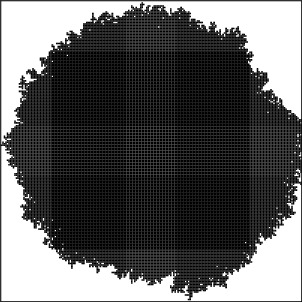
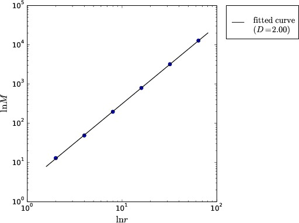
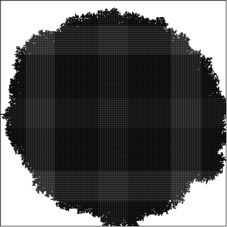
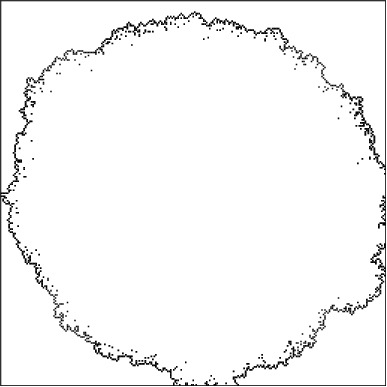
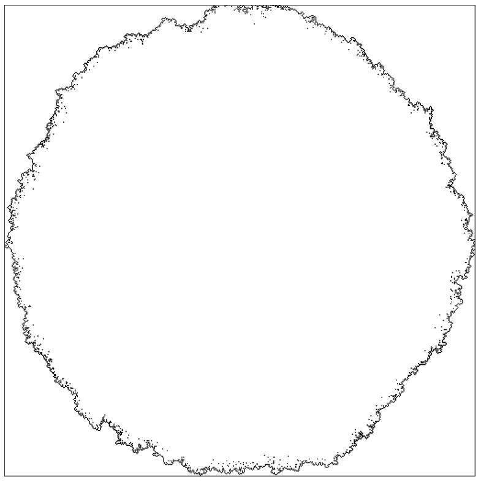

===============================================================================
問題14.6 - イーデン・モデル
===============================================================================

.. contents::

シミュレーションの目的
===============================================================================

成長モデルのさらに簡単な例が1958年にイーデンによって，細胞のコロニーの成長のシミュレーションを行うために提案された．結果の質量分布はフラクタルではないことがわかるが，イーデン成長のアルゴリズムの記述は，フラクタルな成長モデルの一般的な性質を示している．問題14.6ではイーデンクラスターのいくつかの性質について調べることにする．

作成したプログラム
===============================================================================

本シミュレーションで作成したプログラムを以下に示す。

イーデンモデルにより正方格子上でクラスターを生成するプログラム
-------------------------------------------------------------------------------

イーデンモデルのアルゴリズムは，以下のようにまとめられる．

1. 種を原点に置き，占有されていないすべての隣接格子点(成長点と呼ぶ)を探す．

2. 1つの成長点がランダムに選ばれ，占有される．このとき選ばれた成長点は必ず占有されることに注意する．すなわちこれまでのモデルにおいて\ :math:`p=1`\ としたことに対応する．

3. 新しく占有された格子点を成長点のリストから除外し，新しい成長点が加えられる．

4. 2,3の過程を，クラスターが考えている格子サイズの端から端まで連結するまで繰り返すとする．

このモデルと前のモデルとの基本的な相違は，調べられたすべての格子点が占有されることであり，問題14.5の伝染病のモデルとの対応で言えばどの格子点も永久に”免疫”を持つことがない．

以下に，実際に作成したプログラムの内容を示すが，ダイアログの表示，ウィンドウへの格子の描画など，ほとんどの部分は問題14.5で使用したものをそのまま利用できる．したがって，変更した点のみを述べることにすると，関数perc_clusterの内部での挙動は，上で説明したアルゴリズムを実現するように変更されている．1回に1つずつ成長させていくので，リストとして扱っていたnextseedを廃止し，for文を使うことを避けた．成長点のリストnnsiteからランダムに要素を取り出すためにrandomモジュールのchoiceメソッドを用いた．これは与えられたリストの要素数と，生成された乱数の値によって，返す値を決定するものである．

次に，関数b4_pushedについて説明すると，これは種を中心とした半径\ :math:`r`\ の円の中に含まれる，占有された格子点の数を計算し，それを両対数グラフにして表示するものである．rlatticeが実際の格子における種からの距離を表現するものとなっており，rlatticeのなかで距離\ :math:`r`\ (プログラム上では_r)より小さい値をもつところの座標がsに記録される．この座標sは格子点より右下の1/4の部分のものであり，格子の中心を(0,0)としているので，そのまま使うには都合の悪い形をしている．したがって，次のset_in_rで実際の格子上での座標に置き換えられた\ :math:`(x,y)`\ の組にし，座標の重複は除かれる．その2行後で(\ :math:`x`\ の列，\ :math:`y`\ の列)の形に整形されて，M_rでその座標において値が1であるものの総数を計算している．半径\ :math:`r`\ は\ :math:`2^i\ (i=1, 2, \cdots)`\ ととり，\ :math:`r`\ は格子の中心から端までの距離を超えないようにしている．

* 14-6_Eden_model.py(\ :download:`download <14-6_Eden_model.py>`\ )

.. literalinclude:: 14-6_Eden_model.py
    :language: python
    :linenos:

実習課題
===============================================================================

* イーデンモデルにしたがって正方格子上でクラスターを形成せよ．周辺の点を無制限に占有し続けるならば，何が起こるだろうか．問題14.3の手順に従い，種の格子点から距離\ :math:`r`\ の範囲内の占有された格子点の数\ :math:`M(r)`\ を求めよ．十分に大きな\ :math:`r`\ に対して\ :math:`M(r)\sim r^{D}`\ を仮定し，\ :math:`r`\ に対する\ :math:`M`\ の両対数プロットの傾きから\ :math:`D`\ を求めよ．得られたデータからイーデンクラスターはコンパクトであると結論できるか．

作成したプログラムを用いて，イーデンモデルにより正方格子上でクラスターを形成した．\ :math:`L=201`\ としたときのクラスターの様子を\ :num:`図#fig-14-6-f1`\ に示す．この図から，イーデンモデルによるクラスターは，これまで生成したクラスターとは異なり，クラスターの内部の点はほとんどが占有されていて，穴の多いフラクタル的な構造とはなっていないことが分かる．

次に，種の格子点から距離\ :math:`r`\ の範囲内の占有された格子点の数\ :math:`M(r)`\ を求め，\ :math:`r`\ に対する\ :math:`M`\ の両対数プロットを\ :num:`図#fig-14-6-f2`\ に示した．このグラフより，\ :math:`M(r) \sim r^{D}`\ と表すことができて，その傾き\ :math:`D`\ は\ :math:`D\approx2.00`\ となることが分かる．すなわち，フラクタル次元\ :math:`D`\ が2でユークリッド次元と等しく，したがってイーデンクラスターはコンパクトであると言える．

.. _fig-14-6-f1:

    
    格子サイズ\ :math:`L=201`\ のとき，生成されたイーデンクラスター

.. _fig-14-6-f2:

    
    種の格子点からの距離\ :math:`r`\ とその内部の占有された格子点数\ :math:`M(r)`\ の関係(\ :math:`L=201`\ )

* 周辺の点つまり成長点だけが示されるようにプログラムを修正せよ．大部分の周辺の点はクラスターの中心から見てどこにあるか．計算時間と忍耐の許す限り大きなクラスターを成長させよ．

\ :math:`L=257`\ としたとき，もとのイーデンクラスターと，その成長点のみを表示したものとを，\ :num:`図#fig-14-6-f3`\ ，\ :num:`図#fig-14-6-f4`\ に示す．この図から，成長点の大部分はクラスターの外縁にあることが分かる．

.. _fig-14-6-f3:

    
    格子サイズ\ :math:`L=257`\ のとき，生成されたイーデンクラスター

.. _fig-14-6-f4:

    
    格子サイズ\ :math:`L=257`\ のとき，イーデンクラスターの成長点

また，\ :math:`L=513`\ としたときのクラスターの成長点を描画したものを\ :num:`図#fig-14-6-f5`\ に示した．

.. _fig-14-6-f5:

    
    格子サイズ\ :math:`L=513`\ としたとき，イーデンクラスターの成長点

まとめ
===============================================================================

クラスターの生成方法としてよく知られたイーデンモデルについて学び，またその生成されたクラスターはフラクタル図形ではなく，コンパクトであることを確認できた．

